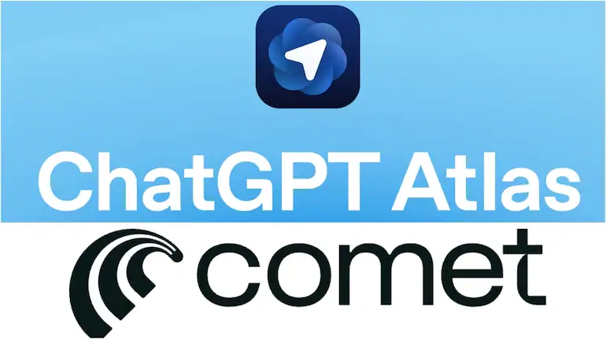

# ChatGPT Atlas vs Perplexity Comet: Which AI Browser Actually Fits Your Workflow?

---

Two new AI browsers just dropped, and they couldn't be more different. ChatGPT Atlas wants to do your work for you—autonomously executing tasks across apps and websites. Perplexity Comet wants to make you smarter—synthesizing live web information while you stay in control. If you're trying to figure out which AI browser deserves a spot in your daily routine, the answer isn't about which one has "better AI." It's about whether you want a system that acts for you or thinks with you.

---

## The Fork in the Road: Execution vs Intelligence

AI-embedded browsing just split into two camps. One side believes AI should handle entire workflows autonomously—scraping data, filling forms, scheduling meetings. The other side thinks AI should compress information and accelerate decisions, but humans should click the final button.

ChatGPT Atlas is firmly in the first camp. It's built on a planning-and-execution engine that can reason through multi-step tasks, correct itself mid-process, and switch between visual browsing, terminal commands, and API calls. You tell it what you want done, and it goes off and does it.

Perplexity Comet sits in the second camp. It doesn't execute tasks in the world. Instead, it pulls fresh information from the live web, synthesizes it with citations, and presents you with verified intelligence. You still do the clicking. You still make the call.

This isn't a feature difference. It's a philosophical split about what AI browsers should even be.

## When Atlas Wins: Closed-World Tasks That Need Doing

Atlas shines when the task is structured, repeatable, and doesn't require real-time information. Think: building a financial model from uploaded CSVs, automating slide decks from meeting notes, or scraping competitor pricing into a spreadsheet.

The system can chain actions across multiple tools. It can open a browser, extract data, switch to a terminal, run a script, then dump results into a Google Sheet—all from one natural language instruction. You set permissions once, then let it run.

The trade-off? Atlas doesn't prioritize freshness. It's optimized for throughput and capability, not for pulling the latest news or verifying live sources. If your task lives inside a controlled environment and doesn't change by the hour, Atlas is architecturally suited.

## When Comet Wins: Real-Time Research and Verifiable Synthesis

Comet is built for scenarios where timeliness and source credibility matter more than automation. Researching breaking news, checking technical documentation, comparing product specs, or validating claims in real time—this is where Comet pulls ahead.

Every answer comes with citations. Every synthesis is grounded in live web data. The AI doesn't act on your behalf; it compresses the web into a decision-ready format and hands it back to you. You stay in the loop at every step.

👉 [See how Perplexity handles real-time research better than traditional search](https://pplx.ai/ixkwood69619635)

The design deliberately stops short of irreversibility. Comet won't book your flight or send your email. It will tell you which flight makes sense and draft the email for you to review. For research-heavy roles—journalists, analysts, strategists—this is a feature, not a limitation.

## The Command Surface vs the Browsing Surface

Atlas is dialogue-first. You interact with it through natural language instructions, like you're briefing an assistant. The quality of your prompt directly affects the quality of the outcome. You need to trust the system and be clear about what you want.

Comet is browser-first. The AI lives as a native layer on top of your normal browsing behavior—sidebars, pull-ups, inline summaries. It feels less like giving orders and more like having a smart co-pilot who whispers useful context as you navigate.

Result: Atlas requires higher cognitive commitment upfront but delivers hands-off execution. Comet requires lower commitment and feels like a transparent augmentation of what you're already doing.

## Autonomy vs Explainability: The Core Trade-Off

Atlas optimizes for autonomy under a permissioned trust model. You grant it access, and it handles the rest. The system prioritizes capability and throughput, sometimes at the expense of day-to-day freshness.

Comet optimizes for explainability. Every claim is linked to a source. Every synthesis is verifiable. The system prioritizes transparency and recency, but it won't execute actions in the world on your behalf.

One solves the task. The other solves the question.

Autonomy and recency rarely live in the same body. Atlas gives you the former. Comet gives you the latter. Neither is objectively better—they're solving different problems.

## What This Means for Your Workflow

If your work involves repetitive, structured tasks that don't change by the hour—data processing, report generation, workflow automation—Atlas is the better fit. It's built to take instructions and finish work across interfaces without constant supervision.

If your work involves staying current, verifying information, and making judgment calls based on fresh data—research, analysis, content strategy—Comet is the better mental fit. It keeps you in the loop and compresses the live web into decisions.

The difference isn't "which AI is stronger." It's which behavioral contract you're willing to accept. Do you want a system that acts for you, or a system that thinks with you?

## FAQ

**Can ChatGPT Atlas access real-time information like Comet?**  
Atlas can browse the web, but it's not optimized for real-time synthesis or citation-heavy research. Its strength is multi-step execution, not live information grounding.

**Does Perplexity Comet have any autonomous execution capabilities?**  
No. Comet deliberately stops short of taking actions in the world. It synthesizes information and accelerates decisions, but you stay in control at every step.

**Which browser is better for productivity automation?**  
Atlas. It's designed to chain tasks across tools and execute workflows autonomously with permission checkpoints.

**Which browser is better for research and fact-checking?**  
Comet. It prioritizes fresh, source-linked information and explainability over autonomous execution.

**Can I use both browsers for different tasks?**  
Absolutely. They're not competitors in the traditional sense—they're solving different problems. Use Atlas for automation, Comet for research.

---

ChatGPT Atlas and Perplexity Comet represent two diverging paths in AI-native browsing. Atlas is for users who want tasks finished autonomously across interfaces. Comet is for users who want live intelligence without giving up control. 👉 [Discover why Perplexity excels at real-time research and verified synthesis](https://pplx.ai/ixkwood69619635). The choice isn't about which AI is better—it's about which workflow philosophy matches how you actually work.
